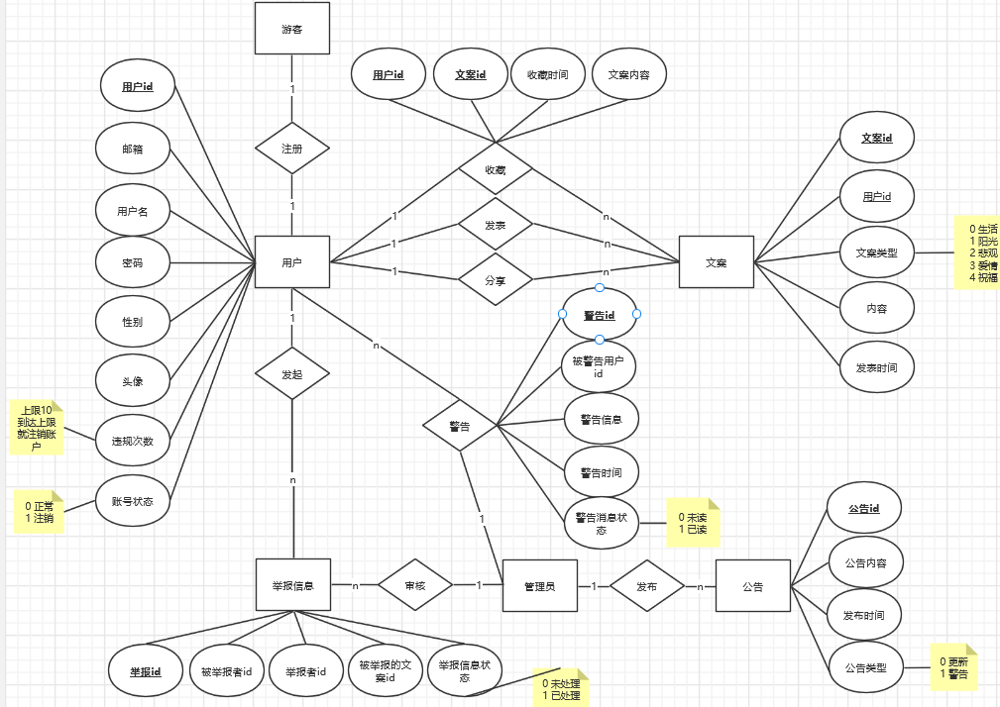

[toc]


# 文案星球 CopyWriting Enjoy

## 项目简介

一个专注于文案分享的平台

##### 功能简介

 + 用户注册、登录、注销
 + 发表、收藏、分享、举报....文案
 + 管理员发布公告、处理举报信息...

## 目录结构说明

### 后端

- src 源码
    - main  
        - java.com.lsy.cw                        项目代码
            - controller                             控制层代码
                - CollectController.java                 收藏控制类
                - CopywritingController.java              文案控制类
                - InformController.java                   举报控制类
                - NotionController.java                   公告控制类
                - UserController.java                     用户控制类
                - WarnController.java                     警告控制类   
            - dao                                     dao层代码
                - CollectDao.java                         收藏Dao
                - CopywritingDao.java                     文案Dao
                - InformDao.java                          举报Dao
                - NotionDao.java                          公告Dao
                - UserDao.java                            用户Dao
                - WarnDao.java                            警告Dao   
            - pojo                                     持久层代码
                - Collect.java                            收藏
                - Copywriting.java                        文案
                - Inform.java                             举报
                - Notion.java                             公告
                - User.java                               用户
                - Warn.java                               警告   
            - service                                   业务层代码
                - impl                                     业务层实现类
                    - CollectServiceImpl.java              收藏业务实现类
                    - CopywritingServiceImpl.java          文案业务实现类
                    - InformServiceImpl.java               举报业务实现类
                    - NotionServiceImpl.java               公告业务实现类
                    - UserServiceImpl.java              用户业务实现类
                    - WarnServiceImpl.java                  警告业务实现类   
                - CollectService.java                       收藏业务接口
                - CopywritingService.java                   文案业务接口
                - InformService.java                        举报业务接口
                - NotionService.java                        公告业务接口
                - UserService.java                          用户业务接口
                - WarnService.java                          警告业务接口   
            - config                                     配置
                - CharsetConfig.java                        解决乱码问题                        
        - resources                                   资源文件
            - static                                     前端静态资源文件
            - vue                                        前端页面
            - application.yml                            项目配置文件
    - test 测试代码
        - java.com.lsy.cw                             测试包
            - cwApplicationTests.java                     测试类


### 前端
前端根目录 `src>main>resources>vue`

+ vue

  + bulid 生产环境
  + config 默认配置
  + src 源码
  + static 不打包的静态资源文件

    + assets 

       + css
       + img
    + comment
    + content 所有组件文件夹
    + route 路由
    + App.vue 入口vue
    + main.js 入口js
  + index.html 入口html

## 数据库设计

### er图


### 逻辑结构设计

+ 用户：`user(uid,uemail,uname,upwd,usex,uface,uillegalTime,ustatus)`
+ 文案：`copywirting(cwid,uid,cwtext,cwtype,cwtime)`
+ 收藏：`collect(uid,cwid,ctime,cwtext)`
+ 公告：`notion(nid,ncontext,ntime,ntype)`
+ 举报：`inform(inid,ineduid,inuid,cwid,instatus)`
+ 警告：`warn(wid,uid,ucontext,wtime,wstatus)`

### sql脚本
```sql
-- 创建数据库 cwenjoy 
create database cwenjoy;
use cwenjoy;

-- 用户
create table user(
    uid int(11) primary key auto_increment,
    uemail varchar(30) not null,
    uname varchar(10) not null,
    upwd varchar(16) not null,
    usex char(2) not null,
    uface varchar(100) not null,
    uillegalTime char(2) not null,
    ustatus char(2) not null
) ;

-- 文案
create table copywriting(
    cwid int primary key auto_increment,
    uid int(11) not null,
    cwtext varchar(200) not null,
    cwtype char(2) not null,
    cwtime timestamp not null,
    foreign key(uid) references user(uid)
)

-- 收藏
create table collect(
   uid int(11) not null,
   cwid int not null,
   ctime timestamp not null,
   cwtext varchar(200) not null,
   foreign key(uid) references user(uid),
   foreign key(cwid) references copywriting(cwid)
)

-- 公告
create table notion(
    nid int primary key auto_increment,
    ncontext varchar(100) not null,
    ntime timestamp not null,
    ntype char(2) not null
)

-- 举报
create table inform(
    inid int primary key auto_increment,
    ineduid int(11) not null,
    inuid int(11) not null,
    cwid int not null,
    instatus char(2) not null,
    foreign key(ineduid) references user(uid),
    foreign key(inuid) references user(uid),
    foreign key(cwid) references copywriting(cwid)
)

--警告
create table warn(
    wid int primary key auto_increment,
    uid int(11) not null,
    wcontext varchar(100) not null,
    wtime timestamp not null,
    wstatus char(2) not null,
    foreign key(uid) references user(uid)
)
```


## 已有用户名单

+ 管理员: id 1、pwd 1111
+ 普通用户1: id 2、pwd 1111 


## 用到的技术

### 后端技术

+ 框架：Spring Boot 

+ 语言：java
+ 模式：mvc

### 前端技术

+ 技术栈：vue2
+ ui组件库：element-ui、muse-ui、semantic-ui
+ 请求接口：axios

#### 技术点

1. localStorage 存储登录信息
2. 

